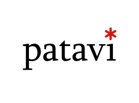
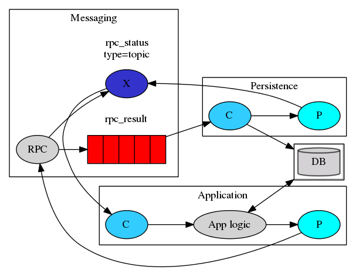
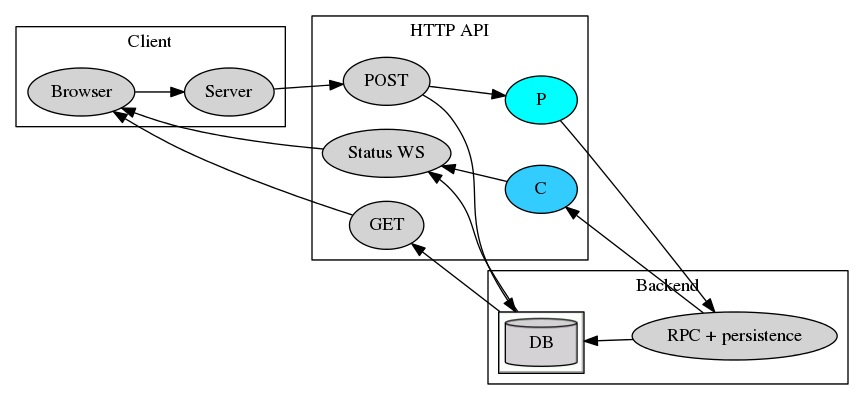
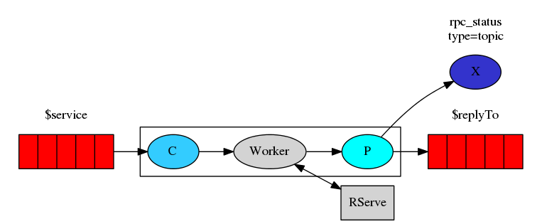

# Patavi



**This is an alpha release.  We are using it internally in production,
  but the API and organizational structure are subject to change.
  Comments and suggestions are much appreciated.**

## Introduction
Patavi is a distributed system for exposing R scripts as web services.
It was created out of the need to run potentially very long running R scripts in a web browser while providing an interface to see the status updates.

## Alternatives
If you are looking for just a web-based interactive R environment checkout [RStudio Shiny](http://www.rstudio.com/shiny/) or [OpenCPU](https://www.opencpu.org/).
If you just want to expose R scripts through HTTP see [FastRWeb](https://www.rforge.net/FastRWeb/) or one of the [many other options](http://cran.r-project.org/doc/FAQ/R-FAQ.html#R-Web-Interfaces).


## Usage

The following components need to be running in the default configuration:

 - RabbitMQ message broker
 - Postgres database (initialize using server/schema.sql)
 - The server - an HTTP API to queue jobs and fetch results (nodejs)
 - Any number of workers

Clients can queue jobs at the server if they present an SSL client certificate trusted by the server.

The following will start a RabbitMQ instance with default (guest/guest) credentials:

```docker run -d --hostname my-rabbit --name my-rabbit -p 5672:5672 -p 15672:15672 rabbitmq:3-management```

How to install and start the rest of the prerequisites can be found in their respective readme's.

## Messaging architecture


Messaging is handled through a [RabbitMQ](https://www.rabbitmq.com/) instance, which provides robust and scalable messaging.

Tasks can be submitted to a work queue named for the specific service.
Workers providing a service consume tasks from the relevant named queue, using fair dispatch: they will only consume another task after they have acknowledged completion of the current task.
The task producer specifies a "reply to" queue and a "correlation id" (task id).
The "reply to" can be an anonymous temporary queue, but in the example above it is a named queue `rpc_result` (to enable persistence, explained below).
Upon completing a task, the worker submits the results to the "reply to" queue (using the "correlation id"), and then acknowledges the message from the task queue.

Optionally, workers can produce status updates by sending messages to the `rpc_status` topic exchange, using `$task-id.status` as the topic.

## Persistence



To enable persistence of tasks and results, the application queueing the task is responsible for persisting the task in a database.
It must also set the "reply to" queue to the queue from which the persistence module will consume results (in this case, `rpc_result`).
The persistence module will consume results using fair dispatch, and acknowledges the result message only after it has been successfully persisted to the database.
Since the application can no longer consume the result message, the persistence layer is responsible for sending a message to the `rpc_status` queue with topic `$task-id.end`.
The application can wait for results by subscribing to the `$task-id.end` topic, or by polling the database.

The persistence module is embedded in the HTTP API server, but is only loosely coupled and could be made to run completely separately and replicated.

Results can be returned either as JSON (`application/json`) or as a multi-part response (`multipart/form-data`). In the latter case, it is expected to contain an index JSON file in the `index` field. This index JSON should contain hyperlinks to any of the other files included in the multi-part response.

## HTTP API



The HTTP API is an additional layer on top of messaging and persistence.
Write routes require a valid and trusted SSL client certificate to be presented to the server, while read-only routes are world readable.
In the typical configuration displayed above, a server application is responsible for queueing tasks, while status updates and results can be retrieved directly by a client-side application in the browser.
A bower module for angular applications using this pattern is available at [gertvv/angular-patavi-client](https://github.com/gertvv/angular-patavi-client).
The default HTTP API also serves a dashboard where a user can queue tasks, provided that a trusted client certificate is configured in their browser.

The following routes are available:

 - `POST /task?service=$service` will persist and queue up a task for the given service. Expects a JSON request body. If successful, returns `201 Created` with a `Location` header pointing to the newly created task, as well as a JSON response body (see `GET /task/$taskId`).
 - `POST /task?service=$service&ttl=$ttl` queues up a task for the given service, with a time to live set by `$ttl` in ISO duration format, e.g. `PT5M` means a time to live of 5 minutes. The task and results will be removed some time after the time to live has expired, counting from task completion.
 - `GET /task/$taskId` returns basic task information:
    ```
    {
      "id": "550e35d797400000",
      "service": "slow",
      "status": "done",
      "_links": {
        "self": { "href": "https://patavi.drugis.org/task/550e35d797400000" },
        "results": { "href": "https://patavi.drugis.org/task/550e35d797400000/results" },
        "updates": { "href": "wss://patavi.drugis.org/task/550e35d797400000/updates" }
      }
    }
    ```
   The link to results will only appear once results are actually available.
 - `GET /status?task=$taskId1&task=$taskId2` returns basic task information for multiple tasks as a JSON array.
 - `DELETE /task/$taskId` will remove a task and its results from the database.
 - `GET /task/$taskId/results/` will return the results (index) of task execution as is, if available.
   If the results are not (yet) available a `404 Not Found` response will be given.
 - `GET /task/$taskId/results/$fileName` will return a result file, if the results consist of multiple files. The index should contain links to all results files.
 - `WebSocket /task/$taskId/updates` will send messages of the form
   ```
   {
     "taskId": "550e35d797400000",
     "eventType": "done",
     "eventData": {
       "href": "https://patavi-test.drugis.org/task/550e35d797400000/results"
     }
   }
   ```
   If `eventType` is "progress", `eventData` contains progress information as sent by the worker. If `eventType` is "done" or "failed", the `eventData` contains a link to the results. If the task exists and ever completes or has already completed, at least one message with `eventType` "done" or "failed" will be sent to the client. It is therefore always safe to wait for such a message. Usage of the web socket is optional. If progress updates are not important, `/task/$taskId` can be polled periodically instead.

Note that although the URLs of these routes are predictable, the only route that a client needs to be aware of is the task creation route. All other locations are communicated explicitly by the API.

The HTTP API can also be safely replicated, and currently contains the persistence layer as a loosely coupled module.
It is implemented in Node.js.

## Workers



The workers consume tasks from the work queue for the service they provide, and send results to the specified "reply to" queue, and may send progress updates to the `rpc_status` exchange.
They are completely unaware of the persistence layer, and whether or not it is present.

The worker executes tasks by running an R script using an [RServe](https://rforge.net/Rserve/) instance and passing in the task JSON as parameters.
It is implemented in Clojure.

## Licence

See [LICENSE](LICENSE).
